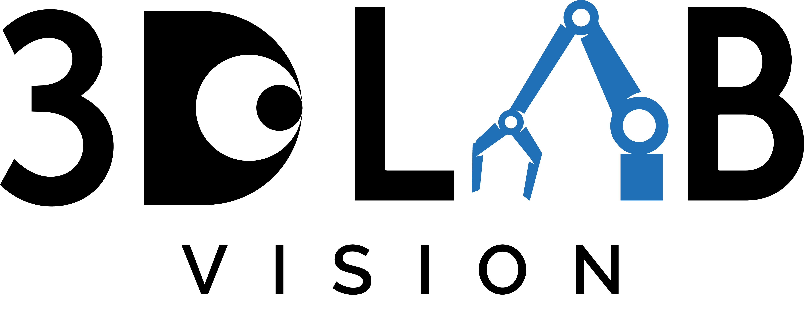

<h1>Recovering Dynamic 3D Sketches from Videos</h1>
<h4>🔥 Accepted on CVPR 2025 🔥</h4>

[**Jaeah Lee**](http://jaeah.me/) · [**Changwoon Choi**](https://changwoon.info/) · [**Young Min Kim**](https://3d.snu.ac.kr/members/) · [**Jaesik Park**](https://jaesik.info/)

    
    &nbsp; &nbsp;
    

    

<!--  -->

TL;DR: <b>Liv3Stroke🖊️</b> reconstructs <em>dynamic sketches</em> with <em>deformable 3D strokes</em> directly from video frames!

*To be released soon…*

## 📧 Contact

If you have any questions, please email `hayanz@snu.ac.kr`.